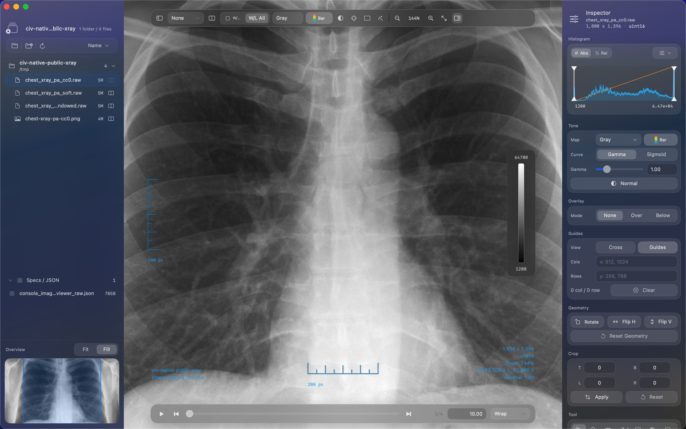
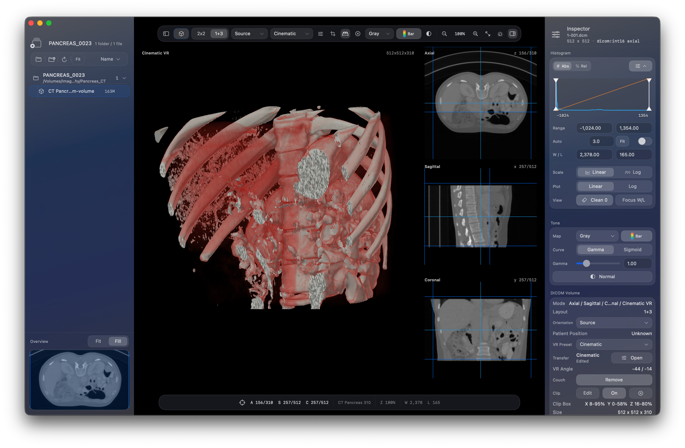
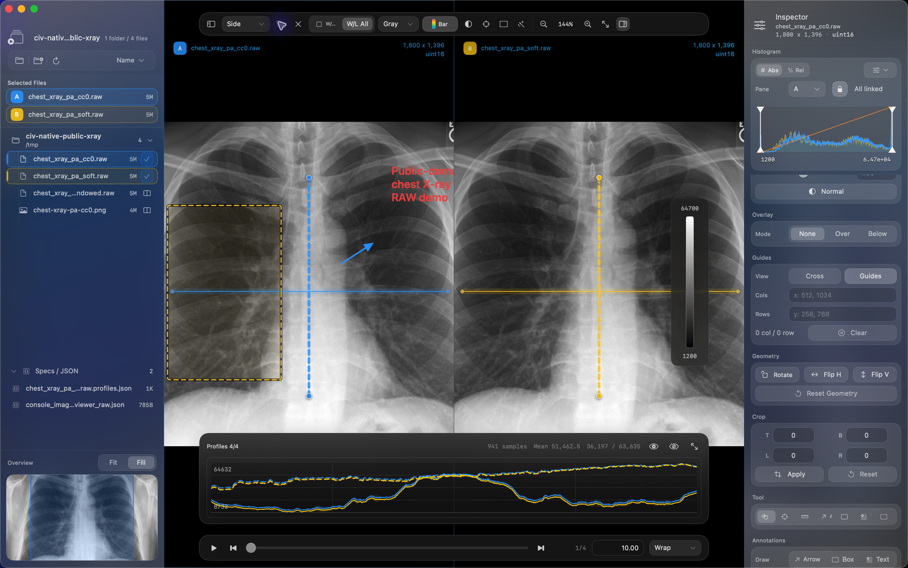
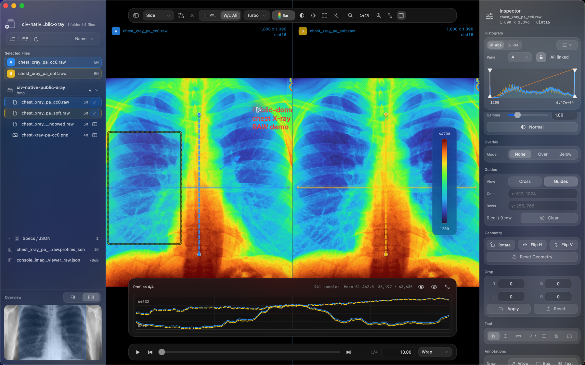
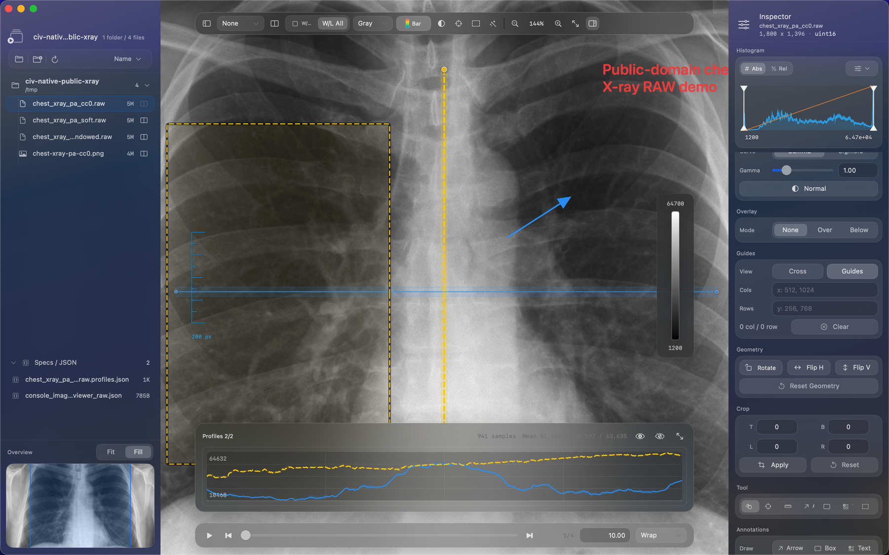
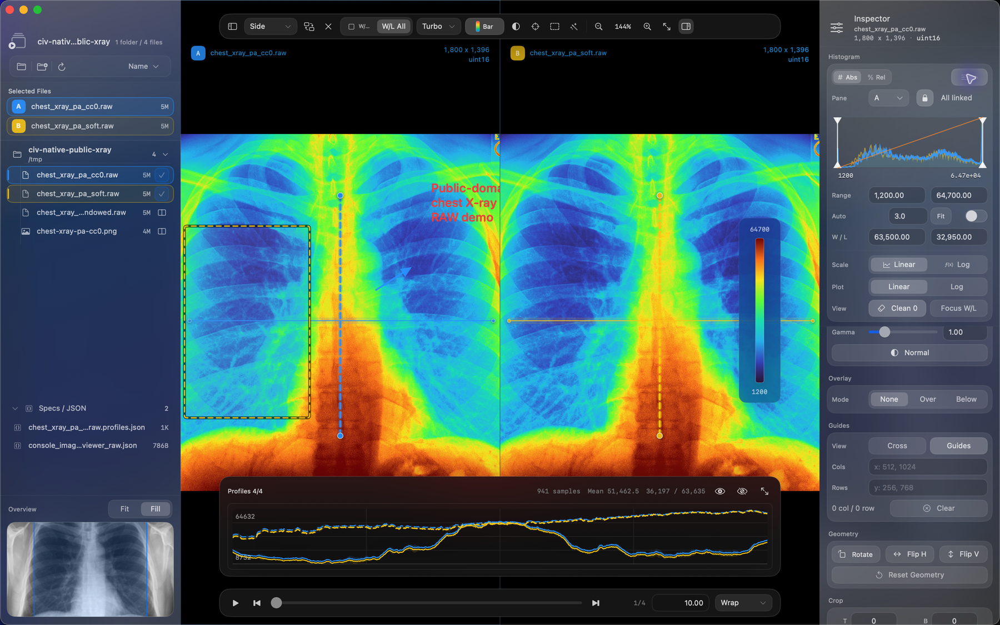

# CIV Native

  

**CIV Native** is a macOS image viewer for RAW, DICOM, and research image inspection. It focuses on dense reviewer workflows: window/level, histograms, linked comparison, DICOM 3D volume rendering, line profiles, annotations, and export tools in one native UI.

  <a href="CIV-Native-0.1.2.app.zip"><strong>Download the latest build</strong></a>

  

## Feature Tour

### RAW and DICOM Review

Open image folders, inspect RAW sidecars, adjust window/level, and keep histogram, tone, crop, geometry, metadata, and export controls in the Inspector.

  

### DICOM 3D Volume Rendering

Open DICOM CT series as a volume, review axial/sagittal/coronal MPR views next to cinematic VR, adjust the VR transfer function, and crop the 3D region from the linked MPR panels.

  

### Linked Compare

Compare frames side by side with linked window/level controls, synchronized profiles, selected-file badges, and per-pane adjustment targeting.

  

### Color Maps and Tone

Switch between grayscale, medical-style, and false-color maps such as Turbo, Viridis, Plasma, Magma, Inferno, Bone, Jet, Hot, and HSV.

  

### Profiles and Annotations

Draw line profiles, compare profile curves, annotate regions with boxes/arrows/text, and keep profile sidecars next to RAW data.

  

### Histogram Controls

Use absolute/relative histograms, display range controls, auto range, W/L fields, linear/log plots, zero-bin cleanup, and focused W/L histogram views.

  

## Download

Download the latest app from this repository:

- `CIV-Native-0.1.2.app.zip`

The app is currently distributed as a binary-only preview. Source code may be opened later.

## Install

1. Download `CIV-Native-0.1.2.app.zip`.
2. Unzip it.
3. Move `CIV Native.app` to `/Applications`.
4. On first launch, macOS may block the app because this preview build is not notarized yet. Right-click `CIV Native.app` and choose **Open**.

## Highlights

- RAW image viewing with sidecar metadata
- DICOM image, MPR, and 3D volume rendering workflows
- Fast window/level and histogram controls
- Side-by-side and linked comparison modes
- Cinematic VR presets, transfer-function tuning, and 3D crop controls
- Line profile overlays and profile graph
- Region, arrow, and text annotations
- Gray, Bone, Turbo, Viridis, Plasma, Magma, Inferno, Jet, Hot, and HSV color maps
- Tone controls, color bars, crop/flip/rotate tools
- Image export and MP4 export

## Keyboard Shortcuts

| Shortcut | Action |
| --- | --- |
| `Cmd-O` | Open files or folder |
| `Cmd-Shift-O` | Open folder recursively |
| `[` | Previous image |
| `]` | Next image |
| `Cmd-R` | Refresh |
| `Cmd-E` | Export image |
| `Cmd-0` | Reset view |
| `Cmd-+` | Zoom in |
| `Cmd--` | Zoom out |
| `Cmd-Option-B` | Toggle colorbar |
| `Cmd-Option-C` | Compare with next image |
| `Cmd-Shift-I` | Image operations |
| `Cmd-Option-1` | Toggle Studies panel |
| `Cmd-Option-2` | Toggle Inspector panel |

## Requirements

- macOS 14 or later
- Apple Silicon build in the current preview

## Screenshot Source

The RAW screenshots use RAW conversions of the public-domain image **Chest Xray PA 3-8-2010.png** from Wikimedia Commons. The DICOM volume screenshot is a UI capture from a local sample CT volume.

- Source: https://commons.wikimedia.org/wiki/File:Chest_Xray_PA_3-8-2010.png
- Author: Stillwaterising
- License: CC0 1.0 Universal Public Domain Dedication

## Checksums

See [`SHA256SUMS.txt`](SHA256SUMS.txt).
